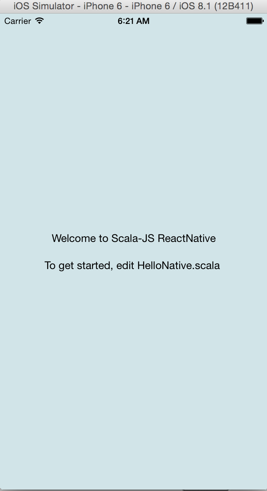

# scalajs-react-native-template

template project for [scalajs-react-native](https://github.com/chandu0101/scalajs-react-native)

#### How to run :

```scala
 cd scalajs-react-native-template
 // start react-native package
 npm install
 npm run start

// open new terminal tab/window
 sbt ~fullOptIOS

 Open ScalaJSReactNativeTemplate.xcodeproj using latest xcode

 Cmd+R - to run project

 Cmd+D - to debug project

 Cmd+B - to build

 Cmd+Shift+K - to cleanup

```

